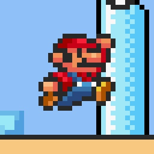

# supermariowar-nx

## About

Super Mario War is, quoting the main project, a fan-made multiplayer Super Mario Bros. style deathmatch game. You can find more information about the game itself and its history on the [main readme](supermariowar/README.md).

This uses:
* the devkitA64 toolchain, [libnx](https://github.com/switchbrew/libnx) and multiple portlibs from [devkitpro](http://devkitpro.org)
* a subrepo of [supermariowar](https://github.com/mmatyas/supermariowar) with switch specific changes

## Usage

Download the latest release, and extract the archive in the `/switch` folder on your SD Card. Then, run the game from the [hbmenu](https://github.com/switchbrew/nx-hbmenu) using [hbl](https://github.com/switchbrew/nx-hbloader).

## Todo
* split joycon option
* networking